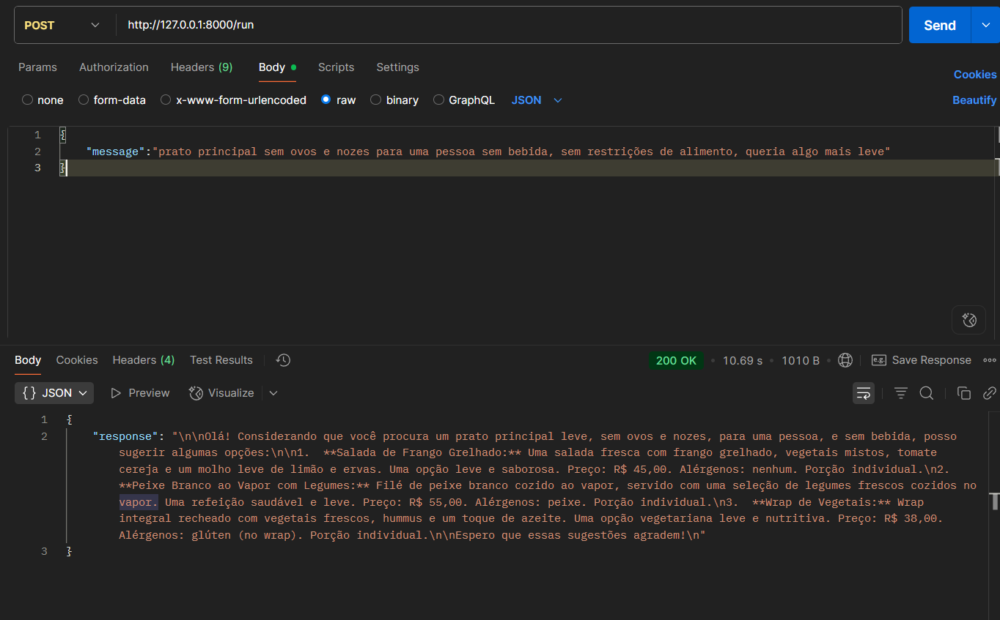

# Waiter Ai Agent


## 🔹 Sobre o Projeto

O Virtual Waiter AI é um agente inteligente voltado para restaurantes, capaz de recomendar pratos aos clientes com base em uma base de dados própria extraída de um arquivo JSON.
O agente coleta informações como nome, descrição, preço, alérgenos e porções de cada prato e oferece recomendações personalizadas, considerando preferências do usuário, restrições alimentares e estilo da refeição.

Caso faltem informações importantes para a recomendação, o agente faz perguntas passo a passo ao usuário, como tipo de prato, restrições alimentares, preferências de estilo ou quantidade de pessoas, garantindo sugestões precisas e adequadas.
Ele simula a experiência de um garçom virtual, respondendo de forma educada e detalhada.

---

## 🎯 Objetivo

- Criar um agente especializado em recomendar pratos de restaurante.

- Consultar semanticamente a base de dados para sugestões precisas.

- Perguntar ao usuário informações passo a passo (tipo de prato, restrições, preferências, etc.) antes de sugerir.

- Retornar informações detalhadas de cada prato: nome, descrição, preço, alérgenos e porções.

- Fornecer no máximo 3 recomendações por consulta, em português ou no mesmo idioma usado pelo usuário.

---

## 🛠 Tecnologias e Ferramentas

- **Python** 3.11

- **Agno** 1.7.12

- **PgVector** para armazenamento vetorial dos dados

- **GeminiEmbedder** para embeddings semânticos

- **FastAPI** para expor a API (opcional)

- **dotenv** para variáveis de ambiente

---

## 📚 Exemplos de uso (inputs)

- "Quero uma sobremesa vegana, leve e refrescante."

- "Sugira um prato principal para duas pessoas sem glúten."

- "Me indique uma entrada com drink sugerido."

- "Estou procurando um prato cremoso e acompanhado de vinho."

---

## 📸 Demonstração na Prática

A imagem abaixo mostra uma requisição à API do **Virtual Waiter AI**, onde o usuário envia suas preferências de prato em formato JSON. O agente processa a solicitação e retorna recomendações personalizadas com base nas restrições e preferências informadas:



---

## ⚙️ Configuração do Projeto

1. Crie um **.venv**:
```bash

python -m venv .venv
```

2. Ative o **.venv**
- Windows
```bash

.venv\Scripts\activate
```
- Linux
```bash

source .venv/bin/activate
```

3. Instale as dependências:
```bash

pip install -r requirements.txt
```

4. Crie um arquivo **.env** na raiz do seu projeto seguindo o arquivo **.env.example** com suas chaves:
```
GOOGLE_API_KEY=your_api_key
POSTGRES_USER=your_user
POSTGRES_PASSWORD=your_password
POSTGRES_DB=your_db
DB_PORT=5532
```

5. Inicie o container com a imagem do pgvector e PostgreSQL:
```bash
docker compose up -d
```

---

## 🚀 Como Rodar
Execute no terminal:
```bash

uvicorn main:app --reload
```

O sistema disponibilizará a URL da API `http://127.0.0.1:8000`, acesse algum software de requisições como o Postman e utilize `/run` com header sendo `Content-Type:application/json`.

No corpo da requisição insira no seguinte modelo:
```json
{
  "message":"solicitação do usuário"
}
```

Ele irá retornar no formato: 
```json
{
  "response":"resposta para o usuário"
}
```
---

## 📝 Estrutura do Projeto

```bash

waiter-ai-agent/
│
├─ agents/
│  └─ waiter_agent.py
│
├─ data/
│  └─ products.json
│
├─ db/
│  └─ connection.py
│
├─ main.py
├─ docker-compose.yaml
├─ .env
├─ requirements.txt
├─ README.md
└─ .gitignore

```

---

## ⚖️ Licença

Este projeto está licenciado sob a MIT License.
